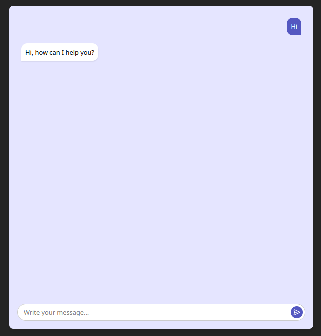

# ChatGPT Integration Example in Vue.js

This project is the **simplest example** of integrating **ChatGPT** with a **Vue.js** frontend.  
It demonstrates how to send prompts to OpenAI's API and display the responses.

---

## Features

- Vue.js frontend
- ChatGPT API integration
- Simple and minimal UI
- Easy to customize for your needs

---

## Getting Started

Follow these steps to run the project:

1. **Install dependencies**

   ```bash
   npm install 
```

2. **Start the development server**

   ```bash
   npm run dev
   ```

3. **Set your OpenAI API key**

   Open `services/chatgptService.js` and replace the placeholder with your OpenAI API key:

   ```js
   const API_KEY = "YOUR_API_KEY_HERE";
   ```

---

## Example Screenshot




---

## Project Structure (Optional)

```
├── public/
├── src/
│   ├── components/
│   │   └── ChatApp.vue
│   ├── services/
│   │   └── chatgptService.js
│   └── App.vue
├── package.json
└── README.md
```

---

## 📌 Notes

* This is a basic starting point — feel free to expand it with better UI/UX or advanced API features.
* Ensure you have access to the OpenAI API: [Get your API key here](https://platform.openai.com/account/api-keys)
